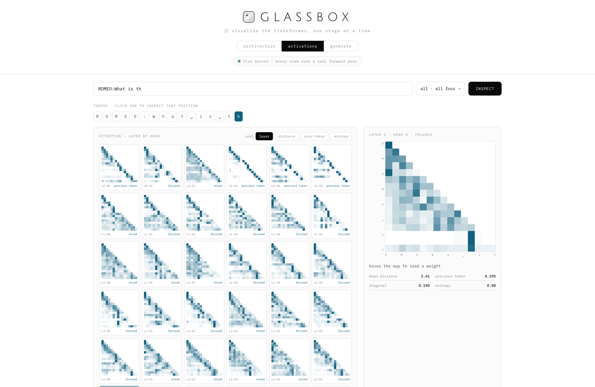
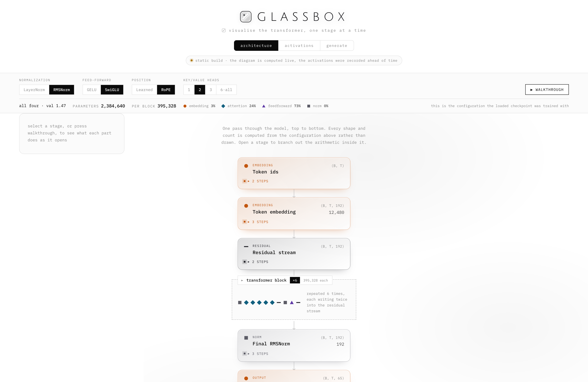
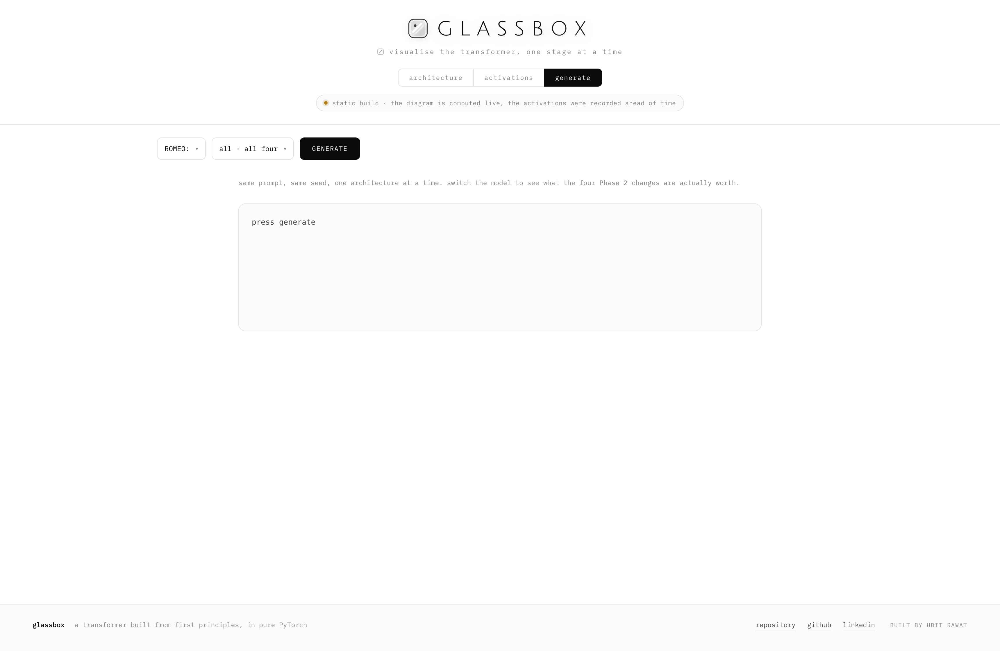

# glassbox

**A transformer built from first principles, to understand it.**

Attention, normalisation, positional encoding, the tokeniser, the training
loop, the sampler, the KV cache — written from scratch in pure PyTorch so that
every line can be explained, tested and watched while it runs. Then an
interactive visualiser that shows what each attention head is actually doing.

**[Open the live demo →](https://udit-rawat.github.io/glassbox/)**



*Thirty-six attention heads from a model trained from scratch, each one a real
map of where it looked. Sorted by behaviour, labelled by what they do.*

## What this is, and what it isn't

**It is a rebuild, not a scale result.** The models are small on purpose: 2.7M
parameters on Tiny Shakespeare, 11M on TinyStories, 49 minutes on a free T4.
The architecture is Llama-*shaped* — RMSNorm, RoPE, SwiGLU, grouped-query
attention — but nowhere near Llama-*sized*, and nothing here should be read as
a competitive number. The goal was to own every line, not to win on scale.

**The dataset path is the well-trodden one.** Tiny Shakespeare then TinyStories
is the standard route for this genre of project, close to the nanoGPT path. The
problem selection here is not original; the execution is where the work went —
the controlled ablation, 194 behavioural tests, and a diagram generated from
the config rather than drawn.

**Half the commercially useful work is still missing.** Phase 4 — LoRA and
adapting a real pretrained model — is not built yet. Training a small model
from scratch demonstrates that the internals are understood. Adapting a large
existing one is closer to what the work actually looks like in practice, and
that half is open.

**No HuggingFace, until Phase 4.** That is a learning constraint, not a claim
about good practice. Nobody should write their own BPE tokeniser at work. The
point was to be unable to hide behind an abstraction while learning what it
does; Phase 4 is where the real libraries come in.

## Why "glassbox"

Most language models are black boxes. This one is built so every component can
be opened, read, tested, and watched while it runs — which is what the
visualiser is for. The opposite of a black box.

## Progress

- [x] **Phase 1 — Attention & the Transformer.** Scaled dot-product
  attention, multi-head attention, causal masking, a full GPT-style
  decoder trained char-level on Tiny Shakespeare.
  *2.7M parameters, validation loss 4.17 → 1.50, ~16 min on an M1.*
- [x] **Phase 2 — Modern LLM internals.** RMSNorm, RoPE, SwiGLU, grouped
  query attention, temperature/top-k/top-p sampling, and a BPE tokenizer
  from scratch.
  *Same data, same seed: validation loss 1.4813 against Phase 1's 1.4990,
  with 12% fewer parameters. KV cache still outstanding.*
- [x] **Phase 3 — A real training run.** TinyStories with mixed precision,
  gradient accumulation, cosine LR schedule, and crash-safe checkpointing.
  *11M parameters, 133M tokens, validation loss 1.5787 — perplexity 4.8,
  against 39.5 for a bigram on the same data. 49 minutes on a free T4.*
- [ ] **Phase 4 — Fine-tuning a real model.** LoRA implemented from
  scratch (~80 lines), then instruction-tuning a real pretrained model.
  *Not started. The most directly applicable phase, and the one still open.*
- [x] **Phase 5 — The visualizer.** Enter a prompt, watch attention heads
  light up per layer, inspect token-by-token next-token probabilities.
  *Plus an architecture diagram generated from the config, with the Phase 2
  switches as live toggles.*

## Reading the numbers

A validation loss means nothing on its own. `scripts/baselines.py` measures what
the same data costs under models that require no learning at all, using the same
BPE tokeniser and the same held-out split, so the trained model can be read
against something rather than against nothing.

| | loss | perplexity |
|---|---|---|
| uniform over the 4,096-token vocabulary | 8.3178 | 4096.0 |
| unigram — token frequency alone | 6.0260 | 414.0 |
| bigram — the previous token only | 3.6774 | 39.5 |
| **glassbox, 11M parameters** | **1.5787** | **4.8** |

So the model is **8.2× lower perplexity than a bigram**, which is the honest
statement of what it learned. What it is *not* is calibrated against published
TinyStories models of comparable size — that comparison would be the next
useful anchor and has not been done.

```bash
python scripts/baselines.py
```

## Phase 5 — the visualizer

A single page with three views, no framework and no build step. Run it against
your own checkpoints, or open the [hosted
demo](https://udit-rawat.github.io/glassbox/).

```bash
python -m glassbox.viz.server --checkpoints checkpoints/ablation
```

### Architecture — generated, never drawn



Every tensor shape and every parameter count comes from the same `GPTConfig`
the model is built from, so the diagram cannot drift out of step with the code.
A test asserts the totals equal `GPT.num_parameters()` across eight
configurations, and they match all seven trained checkpoints exactly.

The four Phase 2 switches are live. Flip **RoPE off** and the position table
reappears in the diagram and the total climbs by exactly `block_size × d_model`.
Open any stage to branch its arithmetic out sideways, or press **walkthrough**
to have the whole model unfold one stage at a time and fold back up.

### Activations — one prompt, one forward pass

Thirty-six attention heads as heatmaps, sortable by **mean attention distance,
previous-token score or entropy**, so heads of a kind cluster instead of
scattering by index. Click one for the enlarged map with token labels; hovering
reports the actual weight, and above the diagonal it tells you the query cannot
see that key because it comes later.

The **logit lens** reads the model's own output head against every layer's
residual stream, so you watch a prediction sharpen with depth. On the trained
model, prompted with `ROMEO:\nWhat is th`:

```
embedding  'h' 1.000     <- the copying bias: the token already present
layer 1    'e' 0.510     <- one block of attention is enough to see "th"
layer 2    'e' 0.534
layer 3    'e' 0.638
layer 4    'e' 0.733
layer 5    'e' 0.778
layer 6    'e' 0.746
```

That first row is the finding from day one, visible: weight tying plus the
residual stream make an untrained model a copier, and it shows up here as the
embedding predicting the character that is already there.

### Generate — the ablation, side by side



The same prompt and the same seed through any of the six ablation checkpoints,
with each one's validation loss and parameter count beside the output. Switching
from `baseline` to `rope` is a real before-and-after of one architecture change.

### Hosting

`scripts/export_static.py` bakes the page into one self-contained HTML file.
The architecture view stays fully interactive there — all 32 switch
combinations are precomputed, because describing a configuration is arithmetic
rather than inference. Activations and generations are **recordings of real
forward passes**, since a static host has no Python behind it, and the page
says so rather than pretending otherwise.

## Phase 3 result — it writes English

An 11M-parameter model, trained from scratch on 133 million tokens of
TinyStories with a from-scratch BPE tokenizer, in 49 minutes on a free T4.
Validation loss 1.5787, which is a perplexity of 4.8 against a vocabulary of
4,096 — the model has narrowed four thousand options down to about five.

Prompted with `The dog was very sad because`, sampled at temperature 0.8 and
top-p 0.9:

```
The dog was very sad because he could not be friends with a cat. The cat
wanted to be friends with the dog, but the dog was too big and strong. So,
the cat tried to play with the dog. But the dog was too big and the cat
could not lift it.

The cat found a big tree to sit under. The cat was very happy. The cat and
the dog became best friends. They played and laughed together every day.
```

And from `Once upon a time, there was a little`, it produced a complete story
with two named characters, dialogue, an argument over a toy box, a consequence,
and a closing line: *"The moral of the story is to not fight and be kind to each
other."*

Nothing taught it story structure, dialogue punctuation, or that stories end
with a moral. All of it is a consequence of predicting the next token.

```
iter    500  train 2.8910  val 2.8883
iter  5000  train 1.8613  val 1.8735
iter 10000  train 1.7052  val 1.7308
iter 15000  train 1.6060  val 1.6222
iter 20000  train 1.5555  val 1.5787
```

The train/validation gap is 0.023, so this is undertrained rather than overfit —
loss was still falling when the schedule ran out.

```bash
python scripts/prepare_tinystories.py --train-mb 500 --vocab-size 4096
python scripts/train_tinystories.py --max-iters 20000 --schedule cosine
```

## Phase 1 result

A 2.7M-parameter decoder trained from scratch on Tiny Shakespeare, character
level, on an M1 laptop. Validation loss falls from 4.17 — the loss of a uniform
guess over 65 characters — to 1.50 in about sixteen minutes.

```
iter   500  train 2.0469  val 2.1112
iter  1500  train 1.5135  val 1.7014
iter  2500  train 1.3899  val 1.5871
iter  3500  train 1.3198  val 1.5430
iter  5000  train 1.2703  val 1.4990
```

Sampled at temperature 0.8, top-k 40, from the prompt `ROMEO:`:

```
ROMEO:
O, my lord, that I will fear:
Seal I hard not sent daughter, I know not what I live you mock:
I know not into your own city, and you be so passed
But, no sir, and no man as not resolved
Might have menDed man's study flesh eyes.

POMPEY:
Men in the maid of hope may be gone of her with her
my husband
```

Nothing here was given to the model: not that speakers are capitalised and
followed by a colon, not that lines break where they do, not a single English
word. It learned all of it from raw characters and next-character prediction.
The grammar is local and the meaning does not survive a full sentence, which is
exactly what 2.7M parameters at character level buys.

```bash
python scripts/train_shakespeare.py --max-iters 5000 --lr 1e-3
python scripts/sample.py --prompt "ROMEO:" --temperature 0.8 --top-k 40
```

## Setup

```bash
python3 -m venv .venv
source .venv/bin/activate
pip install -e ".[dev]"

pytest tests/ -q              # 18 behavioural tests
python scripts/sanity_check.py  # untrained forward pass, shapes and loss
```

## Layout

```
glassbox/
├── model/       # attention, blocks, the GPT — evolves Phase 1 → 2
├── tokenizer/   # char-level, then BPE from scratch
├── training/    # corpus, batching, the training loop
├── sampling/    # greedy, temperature, top-k, top-p
└── viz/         # the attention visualizer
scripts/         # train, sample, sanity check
tests/           # behavioural tests: causality, invariants, shapes
notes/           # per-module notes: what it does and why it exists
```

## Design principles

- **Every attention call returns its weights.** From the first commit —
  the visualizer is a rendering problem, not a refactor.
- **Tests verify behavior, not execution.** Perturbing a future token
  must not change past outputs; that's causality, proven.
- **Each phase ships on its own.** The repo is presentable at every tag.
- **Every module carries a note** on what it does and why it exists
  that way.

Runs on Apple Silicon (MPS) with CPU fallback; heavier training runs on a
free cloud GPU. Device-agnostic throughout.
